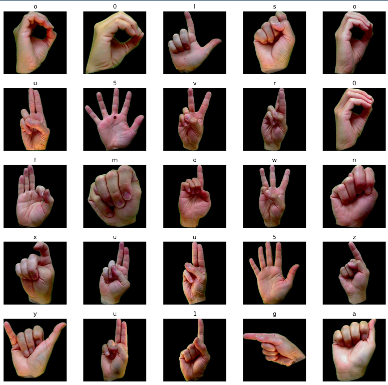
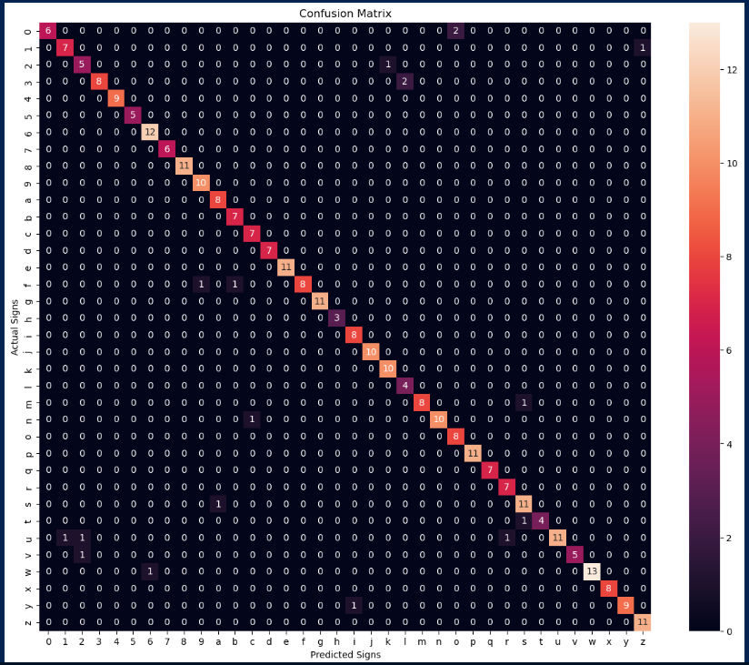

🖐️ Sign Language Translation using CNN and OpenCV 
Welcome to the Sign Language Translation project! This repository contains a deep learning model that translates American Sign Language (ASL) alphabet signs into corresponding letters using a Convolutional Neural Network (CNN). The project integrates this model with OpenCV for real-time gesture detection. 📸

🌟 Project Overview  
This project aims to build a system capable of translating sign language into text. By leveraging a CNN trained on images of hand gestures, the model can accurately classify ASL signs and detect them in real-time using a webcam or video feed.

💻 Technologies Used
Python 🐍 
TensorFlow/Keras 🤖 
OpenCV 👁️ 
Scikit-learn 📊 
Matplotlib 📉 
Seaborn 🎨 
NumPy 🧮 
Pandas 🐼  
📂 Dataset 
We use a dataset of American Sign Language (ASL) alphabet images, representing each letter (A-Z) and digits (0-9). The images are preprocessed and fed into the CNN model for training.

🏗️ Model Architecture
The model is constructed with the following layers:

Conv2D: Convolutional layers to extract features 🕵️‍♂️
MaxPooling2D: Pooling layers to reduce dimensionality 📏
Flatten: Converts 2D matrices to a 1D vector ➡️
Dense: Fully connected layers for classification 🎯
🚀 Installation
Clone the repository:

bash
Copy code
git clone https://github.com/Vanshahuja1/sign-language-translation.git
cd sign-language-translation
Install the dependencies:

Download the ASL dataset and place it in the data/ directory.

🎯 Usage
Training the Model
Run the SIGN_LANGUAGE_TRANSLATION.ipynb notebook to preprocess the data, build the model, and train it.

Real-Time Detection
After training, use OpenCV to capture real-time video and perform gesture detection.

python
Copy code
import cv2 as cv

# Load the trained model
model = tf.keras.models.load_model('path_to_your_model.h5')

# Use OpenCV to capture real-time video
cap = cv.VideoCapture(0)

while True:
    ret, frame = cap.read()
    if not ret:
        break
    
    # Preprocess the frame and make predictions
    # Add your code here

    cv.imshow('Sign Language Detection', frame)
    if cv.waitKey(1) & 0xFF == ord('q'):
        break

cap.release()
cv.destroyAllWindows()
📊 Results
Dataset Samples

Confusion Matrix

Accuracy and Loss Graphs

🤝 Contributing
Contributions are welcome! Feel free to submit a Pull Request or open an issue.

📜 License
This project is licensed under the MIT License - see the LICENSE file for 
